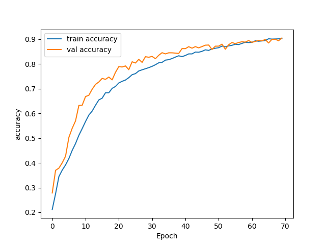
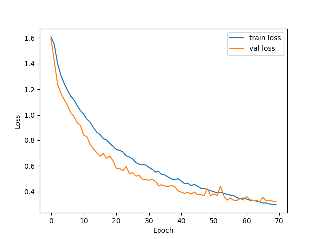
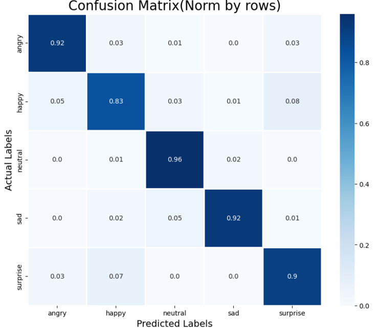

# Capstone Project: Audio Classification for Emotions
---
### Background

Communication plays a vital role in building and maintaining relationships with one another. Emotional projection is one of the first telltale signs that we notice or observed during a conversation. Our emotions can not only be portrayed by what words we say but also how we say them. Changes in the rate of speech, pitch and the degree of loudness or softness of your voice are some examples to help to convey emotional states like angry, sad and happy.

---
### Problem Statement

1) **What is the problem?**
    - Low Emotional quotient (EQ) is the inability to distinguish emotions in both self and others.
    - Cognitive Empathy is the lack of understanding for how others feel.
    - Alexithymia is when a person has difficulty identifying and expressing emotions.

1) **Why do we need to solve it?**
    - Poor performance at school or work from lack of communication, inability to express or understand their grievances.
    - Degrading Physical & Mental well-being due to stress in turn may lead to a more serious situation such as depression or suicide.
    - Failure to foster relationships may lead to them being dysfunctional.
    - Low Social Intelligence due to absence of experience with people.
    - Violent tendencies induced by stress or confusion

1) **How are we going to solve it?**
    - CNN Deep Learning
    - Prediction Model to predict emotion from speech
    - Application to provide educational aid

1) **What will be the benefit?**
    - Given the ability to identify root emotions.
    - Improving and also further enforcing their knowledge related to emotions
---
### Datasets and file format

- **Datasets**
1) ***Toronto emotional speech set (TESS)*** [(source)](https://www.kaggle.com/datasets/ejlok1/toronto-emotional-speech-set-tess)
 In total there are 2800 audio files(WAV format) which are categorized by two voice actors portraying 7 emotions angry, disgust, fear, happy, neutral, surprise & sad.
For each emotion, there are a set of 200 words which were spoken as "Say the word _".

1) ***Emotional Speech Dataset (ESD)*** [(source)](https://github.com/HLTSingapore/Emotional-Speech-Data )
 This dataset contains 35000 files, 350 parallel utterances spoken by 10 native Mandarin speakers, and 10 English speakers with 5 emotional states (neutral, happy, angry, sad and surprise)

1) ***Ryerson Audio-Visual Database of Emotional Speech and Song (RAVDESS)*** [(source)](https://www.kaggle.com/datasets/uwrfkaggler/ravdess-emotional-speech-audio )
 This portion of the RAVDESS contains 1440 files: 60 trials per actor x 24 actors = 1440. The RAVDESS contains 24 professional actors (12 female, 12 male), vocalizing two lexically-matched statements in a neutral North American accent. Speech emotions includes calm, happy, sad, angry, fearful, surprise, and disgust expressions. Each expression is produced at two levels of emotional intensity (normal, strong), with an additional neutral expression.
Emotion (01 = neutral, 02 = calm, 03 = happy, 04 = sad, 05 = angry, 06 = fearful, 07 = disgust, 08 = surprised)

- **Audio File format** [(source)](https://www.izotope.com/en/learn/whats-the-difference-between-file-formats.html)
File format will be using is .wav file.

     Why .wav file?
1) One of the more popular digital audio formats
2) Gold standard in studio recording
3) It captures and recreate and original audio waveform at the highest quality with minimal distortion or loss
4) The closest mathematical/digital representation of the original audio waveform 
---
### Audio features Data processing

Generating basic audio features for audio format.
- **Basic audio features**
    - Channels: 1 for mono and 2 for stereo audio
    - Bit Depth: 1 means 8-bit and 2 means 16-bit
    - Sample rate: frequency of samples used (in Hertz)
    - Sample width: the number of bytes for each sample for a channel.
    - Length: the audio file length (in milliseconds)
    - Sample count: the number of samples in the audio (sample rate(KHz) * duration(s))
    - Intensity: loudness in dB relative to the full scale. 0 dBFS represents the highest possible level in digital gear. All other measurements expressed in terms of dBFS will always be less than 0 dB (negative numbers)
    

***Found 1 corrupted file: YAF_germ_angry.wav***

- **Channels**
    - Found 2 files having 2 channels (Stereo) (By using librosa to load an audio file will make it 1 channel unless the argument for mono=False)

- **Bit depth**
    - All audio files are in 16-bit digital audio which has a maximum dynamic range of 96dB 

- **Sample Rate**
    - Found files to have 3 types of Frame rate 16000 , 24414 , 48000 (By using librosa to load an audio file will make it 22050 Hz unless the argument for sr=None then original frame rate will be )
    - Standardize Frame rate to 22050 Hz which is enough to differentiate audio

- **Sample width**
    - Found 2 files having 4 bytes for each sample. once we load with librosa for mono = True, the 2 file will have 2 bytes for each frame

- **Audio length**
    - Max audio length: 8080ms
    - Min audio length: 1139ms
    - Most common audio length: 3470ms

- **Sample count**
    - Found sample count has 2 population. this is mainly due to the different frame rate.
    - Frame count are related to frame rate so after standardizing Frame rate to 22050 with librosa those with frame rate of 48000 will fall in the same population

- **Intensity**
    - Loudest audio: -14dBFS
    - Softest audio: -64dBFS
    - Most common loudness audio: -33dBFS
---
### Feature Extraction for Audio Analytics [(source)](https://analyticsindiamag.com/a-tutorial-on-spectral-feature-extraction-for-audio-analytics/)
We will be exploring the following Audio features and pick 6 best to train our model.

1) Chromagram
2) Pitch-Decibel analysis
    - Melspectrogram
    - Mel-Frequency Cepstral Coefficients (MFCCs)
1) Spectral analysis
    - Spectral RollOff 
    - Spectral Bandwidth
    - Spectral Contrast
1) Tonal Centroid Features (Tonnetz)
1) Zero-Crossing Rate
1) RMS Energy

#### **1) Chromagram (Pitch analysis)**

Chromatography is a process for separating components of a mixture. In this case the components are pitch classes and the mixure is the audio file. Therefore, the term chromagram represents the pitches under an audio file.It is a form of quality assessment of the sound from higher to medium to lower.

Pitch is the quality of a sound governed by the rate of vibrations producing it. 
There are 12 pitch classes in standard Western music: C, C#, D, D#, E, F, F#, G, G#, A, A# and B 
All pitches fall under one of the 7 letters: A, B, C, D, E, F, and G

- Three types of chromagrams:
   - Waveform chromagram - It classifies the waveform of the sound in different pitch classes.
   - Constant-Q chromagram - This transformation of the signal takes part in the frequency domain and is related to the Fourier Transform and Morlet Wavelet Transform.
   - Chroma energy normalized statistics(CENS) chromagram - Is made up of signals energy form where furthermore transformation of pitch class by considering short time statistics over energy distribution within the chroma bands 

#### **2) Pitch-Decibel analysis**

- Melspectrogram
    - Mel scale is the scale of pitches. It is a representation of frequencies into the Mel scale generates the Mel spectrogram.  
- Mel-Frequency Cepstral Coefficients (MFCCs)
    - Short term power spectrum of any sound represented by the Mel frequency cepstral (MFC) and combination of MFCC makes the MFC.

#### **3) Spectral**

- Spectral Centroid (tone quality)
    - Spectral Centroid is the centre of the spectrum. Using the spectral centroid we can predict the brightness in an audio file.  
- Spectral rolloff (maximum and minimum frequencies)
    - Spectral rolloff is the frequency below which a specified percentage of the total spectral energy.
- Spectral Bandwidth (range frequency)
    - Spectral Bandwidth is the difference between the upper and lower frequencies in a continuous band of frequencies.
- Spectral Contrast (energy range)
    - Spectral Contrast is the measure of the energy of frequency at each timestamp.

#### **4) Tonal Centroid Features (Tonnetz)**

- Tonal Centroid Feature is a projection of chroma features onto a 6-dimensional basis representing the perfect fifth, minor third, and major third each as two-dimensional coordinates.

#### **5) Zero-Crossing Rate**

- Zero-crossing rate is the measure of the rate at which the signal is going through the zeroth line more formally signal is changing positive to negative or vice versa.

#### **6) Root Mean Square Energy**

- The overall magnitude of a signal corresponds to its energy. For audio signals, this generally equates to how loud the signal is.
---
### Preprocessing

Features extracted and used for modeling:
1) Chroma energy normalized statistics (CENS) - the information about the classification of pitch and signal structure.
1) Spectral Bandwidth - the frequency range present
1) Spectral Centroid - the center of mass of the spectrum
1) Mel-frequency cepstral coefficients(MFCC) - the information present in speech signals
1) RMS Energy- The overall magnitude of a signal corresponds to its energy
1) Tonnetz- the tonal centroid features 
---
### Model

**Basic CNN Architecture**[(source)](https://medium.com/techiepedia/binary-image-classifier-cnn-using-tensorflow-a3f5d6746697)

- Conv2D() : Convolutional 2D is to extract the high-level features such as edges from the input by applying filter.

- MaxPool2D() :Max pooling is a pooling operation that takes the maximum input from n x n feature map covered by the filter.

- Flatten() : Converts multi-dimensional input data array to 1D array.
---
### Model Evaluation

1) Macro Average Accuracy will be the main scoring metric to assess how well the model predict TP & TN.
1) Sub metric will be macro average of Precision & Recall
1) Additional metric is Matthew’s correlation coefficient, it ranges from -1 to 1 where 0 means the model is no better than random chance.

- Averaging Techniques for Multiclass classification
    - Macro Average : A simple arithmetic mean of all metrics across classes. This technique gives equal weights to all classes making it a good option for balanced classification tasks.
    - Weighted Average : Accounts for class imbalance by computing the average of binary metrics weighted by the number of samples of each class in the target.

Since our classes are balance we will be mostly looking at Macro average.

---
### Best model

The best model using 6 features and Adamax optimizer with the best metrics scores:
- Train Acc: 0.943
- Test Acc: 0.908
- Train loss: 0.177
- Test loss: 0.304
- Macro avg F1: 0.910
- MCC: 0.885

***Features used:***
1) Chroma CENS
1) Spectral Bandwith
1) Spectral Centroid
1) Mel-frequency cepstral coefficients(MFCC) Normalized
1) Root-Mean-Square (RMS)
1) Tonnetz

***Optimizer used:***
- Adamax

**CNN Architecture**

- The training was stopped with EarlyStopping() when the Validation loss score starts to saturate

- Below is the Confusion Matrix for this Model normalized by rows indicating Recall scores which are over 80%.

---
### Conlusion and Recommendations 

#### Conclusion

- **Best Model CNN**
    - Optimizer Adamax
    - 6 audio features
    - Step up conv2d layers
    - Step down dense layers
The model capability to predict each class(emotion) with a Macro average F1 score of  and MCC score of. Model is not overfitted or underfitting after implementing Drop out and early stop which resulted in on % difference in train and test scores

- **Application benefits**
    - Improved emotional awareness.
    - Better Social Intelligence
    - Overall lifestyle change
With the Audio classifier Application deployed, the targeted group can now be able to have a basic understanding of the 5 emotions through article based or video based learning. This will in turn improve thier emotional awareness and Social inteligence

#### Recommendations

- **Automation implementation**
    - Taking advantage of computer to carry out basic repetitive task

- **Deployment to Education sector**
    - Learning aid
    - Promote social awareness

- **Integration to other services**
    - Networking systems where connecting and interaction with people in similar situations are possible.
    
- **Other Applications**
    -  Customer services: real-time emotional analyzers to streamline services or early detection system to prevent conversations from escalating which may result in tarnished reputation or customer churn rate.
    - Healthcare: Healthcare professionals can use it as a baseline for patients' mental health and adjust their needs accordingly. Mental health is also essential for their road to recovery.
    - Personal application: boosting self cofidence from knowing how you protray yourself to others. 
---
#### Streamlit app

[(Streamlit App)](https://huggingface.co/spaces/Ridzuan/Emotion_Audio_Classifier)