# Project 3: Binary subreddit classification with sentiment and topic words analysis  

## Problem Statement

Web streaming service providers must take notice of their customers' direct feedback.Our data team were tasked to build a machine learning classification model to identify and label words, sentences, or paragraphs taken from online discussion posts, chat rooms or comments related to the provider. Sentiment analysis can be done on them and infer data and knowledge for content management or product review.

---
## Contents:
- [Background](#Background)
- [Webscraping](#Webscraping-for-Subreddit-posts)
- [Data Cleaning](#Data-Cleaning)
- [Exploratory Data Analysis](#Exploratory-Data-Analysis)
- [Data Preprocessing](#Data-Preprocessing)
- [Modeling Process](#Modeling-Process)
- [Pycaret Auto ML](#Pycaret-auto-ML)
- [Conclusions and Recommendations](#Conclusion-and-Recommendation)
---

## Background

For project 3, your goal is two-fold:

1) Using Pushshift's API, you'll collect posts from two subreddits of your choosing.
1) You'll then use NLP to train a classifier on which subreddit a given post came from. This is a binary classification problem.

### DataSet used
* Netlifx posts webscraped from ([*source*](https://www.reddit.com/r/netflix/))
* Disneyplus posts webscraped from  ([*source*](https://www.reddit.com/r/DisneyPlus/))

## Webscraping for Subreddit posts

**Disney plus dataset**

RangeIndex: 34808 entries, 0 to 34807

Data columns (total 3 columns):

i     |Column     |Non-Null Count  |Dtype 
---  |------     |--------------  |----- 
 0   |subreddit  |34808 non-null  |object
 1   |selftext   |22110 non-null  |object
 2   |title      |34808 non-null  |object

**Netflix dataset**

RangeIndex: 50065 entries, 0 to 50064

Data columns (total 3 columns):

 i   |Column     |Non-Null Count  |Dtype 
---  |------     |--------------  |----- 
 0   |subreddit  |50065 non-null  |object
 1   |selftext   |32943 non-null  |object
 2   |title      |50065 non-null  |object
---

## Data Cleaning

- *Step1- checking dataframe structure*

- *Step2- Duplicated Rows*

- *Step3- Nan values*

- *Step4- drop duplicates & Nan values*

---
## Exploratory Data Analysis

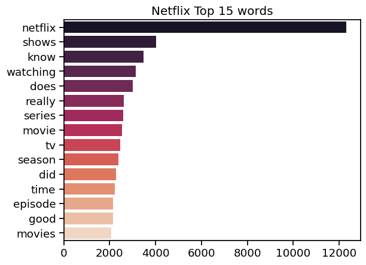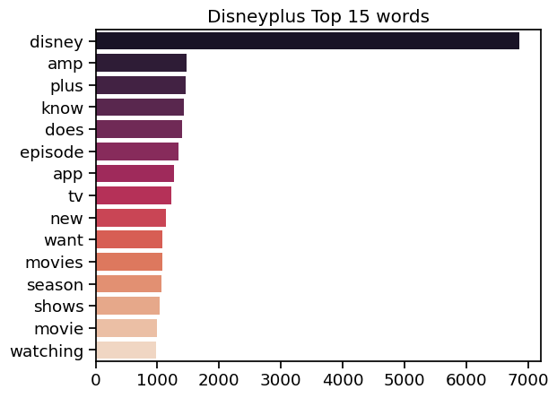 
    
    
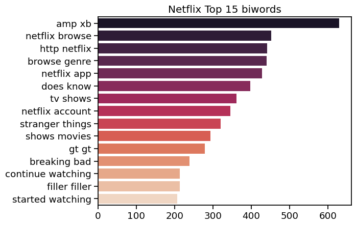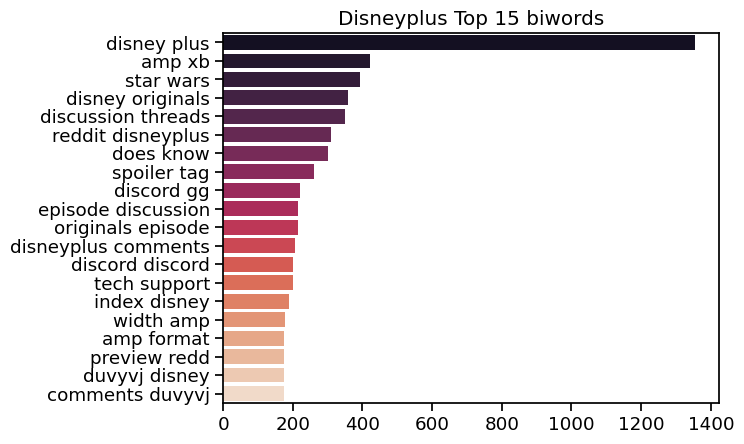 
    
    
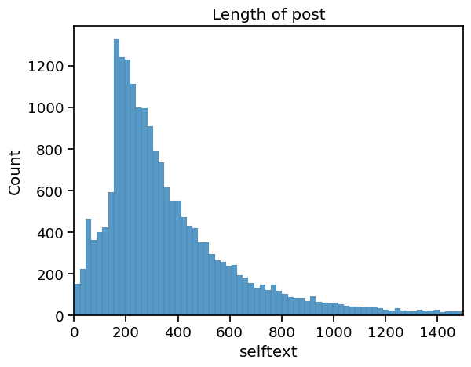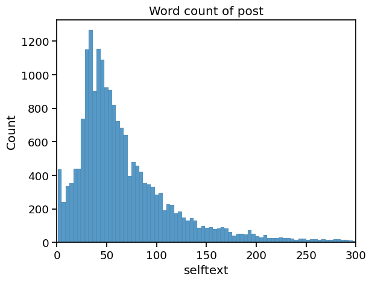 
    

---
## Data Preprocessing

- *Step1- lowercase and demojize emojis*

- *Step2- apply contractions for words in sentence*

- *Step3- apply regex to only keep words in the sentence*

- *Step4- apply lemmatizer for words in sentence*

- *Step5- drop rows with no text after preprocessing *

---
## Model

- **Comparision between normal text vs Augmented Synonym text 1 vs Augmented Synonym text 2**
    - Test metric scores are quite similar except specificity is higher when using normal text is higher
    - Better at predicting True Negative with normal text as feature
    
Score|NB Cvec	|NB Cvec Aug1	|NB Cvec Aug2
---|---|---|---
Acc (train)	|0.83	|0.78	|0.78
Acc (test)	0.81	|0.78	|0.78
Recall (test)	|0.67	|0.73	|0.73
Spec (test)	|0.89	|0.82	|0.81
Prec (test)	|0.77	|0.69	|0.68
F1 (test)	|0.71	|0.71	|0.71
AUC (test)	|0.78	|0.77	|0.77

    
---
- **Count vs TFIDF Vectorizer**
    - Both vectorizer methods yield similar test metric scores with Tf Idf method having a slight advantage for recall.
    
Score|	NB Cvec	|NB Tvec
---|---|---
Acc (train)|	0.83	|0.79
Acc (test)|	0.81	|0.80
Recall (test)|	0.67	|0.71
Spec (test)|	0.89	|0.85
Prec (test)|	0.77	|0.73
F1 (test)|	0.71	|0.72
AUC (test)|	0.78	|0.78

    
---
- **Scores normal text vs Augmented Synonym text 2**
    - for Tf Idf vectorizer method augmented sentance have no effect.
    
Score|	NB Tvec	|NB Tvec Aug2|
---|---|---
Acc (train)|	0.79|	0.72|
Acc (test)|	0.80|	0.80|
Recall (test)|	0.71|	0.71|
Spec (test)|	0.85|	0.85|
Prec (test)|	0.73|	0.73|
F1 (test)|	0.72|	0.72|
AUC (test)|	0.78|	0.78|

---
- **Top 5 models**
    1) Support Vector Machine model with TfIdf Vectorizer using selftext and title for features
    1) Support Vector Machine model with TfIdf Vectorizer using selftext for feature
    1) Light Gradient Boosting model with TfIdf Vectorizer using selftext and title for features
    1) Linear Regression model with TfIdf Vectorizer using selftext for featureusing selftext for feature
    1) Neural Networks with BERT preprocessing using selftext and title for features

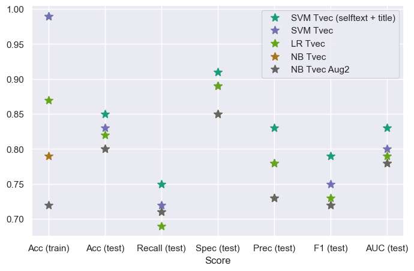

<table border="1" class="dataframe">
  <thead>
    <tr style="text-align: right;">
      <th>Score</th>
      <th>Acc (train)</th>
      <th>Acc (test)</th>
      <th>Recall (test)</th>
      <th>Spec (test)</th>
      <th>Prec (test)</th>
      <th>F1 (test)</th>
      <th>AUC (test)</th>
    </tr>
  </thead>
  <tbody>
    <tr>
      <th>SVM Tvec (selftext + title)</th>
      <td>0.99</td>
      <td>0.85</td>
      <td>0.75</td>
      <td>0.91</td>
      <td>0.83</td>
      <td>0.79</td>
      <td>0.83</td>
    </tr>
    <tr>
      <th>SVM Tvec</th>
      <td>0.99</td>
      <td>0.83</td>
      <td>0.72</td>
      <td>0.89</td>
      <td>0.78</td>
      <td>0.75</td>
      <td>0.80</td>
    </tr>
    <tr>
      <th>LBM</th>
      <td>0.96</td>
      <td>0.83</td>
      <td>0.70</td>
      <td>0.91</td>
      <td>0.81</td>
      <td>0.75</td>
      <td>0.80</td>
    </tr>
    <tr>
      <th>LR Tvec</th>
      <td>0.87</td>
      <td>0.82</td>
      <td>0.69</td>
      <td>0.89</td>
      <td>0.78</td>
      <td>0.73</td>
      <td>0.79</td>
    </tr>
    <tr>
      <th>BERT Preprocess / Encoding + NN</th>
      <td>0.83</td>
      <td>0.82</td>
      <td>0.61</td>
      <td>0.94</td>
      <td>0.85</td>
      <td>0.71</td>
      <td>0.78</td>
    </tr>
    <tr>
      <th>NB Cvec</th>
      <td>0.83</td>
      <td>0.81</td>
      <td>0.67</td>
      <td>0.89</td>
      <td>0.77</td>
      <td>0.71</td>
      <td>0.78</td>
    </tr>
    <tr>
      <th>SGD Tvec</th>
      <td>0.91</td>
      <td>0.81</td>
      <td>0.59</td>
      <td>0.93</td>
      <td>0.84</td>
      <td>0.69</td>
      <td>0.76</td>
    </tr>
    <tr>
      <th>NB Tvec</th>
      <td>0.79</td>
      <td>0.80</td>
      <td>0.71</td>
      <td>0.85</td>
      <td>0.73</td>
      <td>0.72</td>
      <td>0.78</td>
    </tr>
    <tr>
      <th>NB Tvec Aug2</th>
      <td>0.72</td>
      <td>0.80</td>
      <td>0.71</td>
      <td>0.85</td>
      <td>0.73</td>
      <td>0.72</td>
      <td>0.78</td>
    </tr>
    <tr>
      <th>NB Cvec Aug1</th>
      <td>0.78</td>
      <td>0.78</td>
      <td>0.73</td>
      <td>0.82</td>
      <td>0.69</td>
      <td>0.71</td>
      <td>0.77</td>
    </tr>
    <tr>
      <th>NB Cvec Aug2</th>
      <td>0.78</td>
      <td>0.78</td>
      <td>0.73</td>
      <td>0.81</td>
      <td>0.68</td>
      <td>0.71</td>
      <td>0.77</td>
    </tr>
    <tr>
      <th>RF Tvec</th>
      <td>0.99</td>
      <td>0.76</td>
      <td>0.71</td>
      <td>0.79</td>
      <td>0.66</td>
      <td>0.68</td>
      <td>0.75</td>
    </tr>
    <tr>
      <th>Zeroshot</th>
      <td>0.00</td>
      <td>0.76</td>
      <td>0.55</td>
      <td>0.87</td>
      <td>0.71</td>
      <td>0.62</td>
      <td>0.71</td>
    </tr>
    <tr>
      <th>DTREE Tvec</th>
      <td>0.64</td>
      <td>0.68</td>
      <td>0.62</td>
      <td>0.71</td>
      <td>0.55</td>
      <td>0.58</td>
      <td>0.67</td>
    </tr>
  </tbody>
</table>

---

## Pycaret auto ML

<table id="T_a67de_">
  <thead>
    <tr>
      <th class="blank level0" >&nbsp;</th>
      <th class="col_heading level0 col0" >Model</th>
      <th class="col_heading level0 col1" >Accuracy</th>
      <th class="col_heading level0 col2" >AUC</th>
      <th class="col_heading level0 col3" >Recall</th>
      <th class="col_heading level0 col4" >Prec.</th>
      <th class="col_heading level0 col5" >F1</th>
      <th class="col_heading level0 col6" >Kappa</th>
      <th class="col_heading level0 col7" >MCC</th>
      <th class="col_heading level0 col8" >TT (Sec)</th>
    </tr>
  </thead>
  <tbody>
    <tr>
      <th id="T_a67de_level0_row0" class="row_heading level0 row0" >et</th>
      <td id="T_a67de_row0_col0" class="data row0 col0" >Extra Trees Classifier</td>
      <td id="T_a67de_row0_col1" class="data row0 col1" >0.7878</td>
      <td id="T_a67de_row0_col2" class="data row0 col2" >0.8525</td>
      <td id="T_a67de_row0_col3" class="data row0 col3" >0.9212</td>
      <td id="T_a67de_row0_col4" class="data row0 col4" >0.7843</td>
      <td id="T_a67de_row0_col5" class="data row0 col5" >0.8471</td>
      <td id="T_a67de_row0_col6" class="data row0 col6" >0.5077</td>
      <td id="T_a67de_row0_col7" class="data row0 col7" >0.5259</td>
      <td id="T_a67de_row0_col8" class="data row0 col8" >1.6240</td>
    </tr>
    <tr>
      <th id="T_a67de_level0_row1" class="row_heading level0 row1" >catboost</th>
      <td id="T_a67de_row1_col0" class="data row1 col0" >CatBoost Classifier</td>
      <td id="T_a67de_row1_col1" class="data row1 col1" >0.7892</td>
      <td id="T_a67de_row1_col2" class="data row1 col2" >0.8544</td>
      <td id="T_a67de_row1_col3" class="data row1 col3" >0.9099</td>
      <td id="T_a67de_row1_col4" class="data row1 col4" >0.7912</td>
      <td id="T_a67de_row1_col5" class="data row1 col5" >0.8463</td>
      <td id="T_a67de_row1_col6" class="data row1 col6" >0.5158</td>
      <td id="T_a67de_row1_col7" class="data row1 col7" >0.5294</td>
      <td id="T_a67de_row1_col8" class="data row1 col8" >18.7580</td>
    </tr>
    <tr>
      <th id="T_a67de_level0_row2" class="row_heading level0 row2" >lightgbm</th>
      <td id="T_a67de_row2_col0" class="data row2 col0" >Light Gradient Boosting Machine</td>
      <td id="T_a67de_row2_col1" class="data row2 col1" >0.7925</td>
      <td id="T_a67de_row2_col2" class="data row2 col2" >0.8566</td>
      <td id="T_a67de_row2_col3" class="data row2 col3" >0.8861</td>
      <td id="T_a67de_row2_col4" class="data row2 col4" >0.8076</td>
      <td id="T_a67de_row2_col5" class="data row2 col5" >0.8449</td>
      <td id="T_a67de_row2_col6" class="data row2 col6" >0.5333</td>
      <td id="T_a67de_row2_col7" class="data row2 col7" >0.5392</td>
      <td id="T_a67de_row2_col8" class="data row2 col8" >0.7370</td>
    </tr>
    <tr>
      <th id="T_a67de_level0_row3" class="row_heading level0 row3" >rf</th>
      <td id="T_a67de_row3_col0" class="data row3 col0" >Random Forest Classifier</td>
      <td id="T_a67de_row3_col1" class="data row3 col1" >0.7804</td>
      <td id="T_a67de_row3_col2" class="data row3 col2" >0.8362</td>
      <td id="T_a67de_row3_col3" class="data row3 col3" >0.9106</td>
      <td id="T_a67de_row3_col4" class="data row3 col4" >0.7814</td>
      <td id="T_a67de_row3_col5" class="data row3 col5" >0.8410</td>
      <td id="T_a67de_row3_col6" class="data row3 col6" >0.4926</td>
      <td id="T_a67de_row3_col7" class="data row3 col7" >0.5082</td>
      <td id="T_a67de_row3_col8" class="data row3 col8" >1.3610</td>
    </tr>
    <tr>
      <th id="T_a67de_level0_row4" class="row_heading level0 row4" >xgboost</th>
      <td id="T_a67de_row4_col0" class="data row4 col0" >Extreme Gradient Boosting</td>
      <td id="T_a67de_row4_col1" class="data row4 col1" >0.7838</td>
      <td id="T_a67de_row4_col2" class="data row4 col2" >0.8492</td>
      <td id="T_a67de_row4_col3" class="data row4 col3" >0.8859</td>
      <td id="T_a67de_row4_col4" class="data row4 col4" >0.7977</td>
      <td id="T_a67de_row4_col5" class="data row4 col5" >0.8394</td>
      <td id="T_a67de_row4_col6" class="data row4 col6" >0.5113</td>
      <td id="T_a67de_row4_col7" class="data row4 col7" >0.5186</td>
      <td id="T_a67de_row4_col8" class="data row4 col8" >1.7230</td>
    </tr>
    <tr>
      <th id="T_a67de_level0_row5" class="row_heading level0 row5" >lr</th>
      <td id="T_a67de_row5_col0" class="data row5 col0" >Logistic Regression</td>
      <td id="T_a67de_row5_col1" class="data row5 col1" >0.7776</td>
      <td id="T_a67de_row5_col2" class="data row5 col2" >0.8452</td>
      <td id="T_a67de_row5_col3" class="data row5 col3" >0.8864</td>
      <td id="T_a67de_row5_col4" class="data row5 col4" >0.7905</td>
      <td id="T_a67de_row5_col5" class="data row5 col5" >0.8356</td>
      <td id="T_a67de_row5_col6" class="data row5 col6" >0.4952</td>
      <td id="T_a67de_row5_col7" class="data row5 col7" >0.5035</td>
      <td id="T_a67de_row5_col8" class="data row5 col8" >0.2570</td>
    </tr>
    <tr>
      <th id="T_a67de_level0_row6" class="row_heading level0 row6" >svm</th>
      <td id="T_a67de_row6_col0" class="data row6 col0" >SVM - Linear Kernel</td>
      <td id="T_a67de_row6_col1" class="data row6 col1" >0.7770</td>
      <td id="T_a67de_row6_col2" class="data row6 col2" >0.0000</td>
      <td id="T_a67de_row6_col3" class="data row6 col3" >0.8871</td>
      <td id="T_a67de_row6_col4" class="data row6 col4" >0.7898</td>
      <td id="T_a67de_row6_col5" class="data row6 col5" >0.8352</td>
      <td id="T_a67de_row6_col6" class="data row6 col6" >0.4934</td>
      <td id="T_a67de_row6_col7" class="data row6 col7" >0.5034</td>
      <td id="T_a67de_row6_col8" class="data row6 col8" >0.2100</td>
    </tr>
    <tr>
      <th id="T_a67de_level0_row7" class="row_heading level0 row7" >ridge</th>
      <td id="T_a67de_row7_col0" class="data row7 col0" >Ridge Classifier</td>
      <td id="T_a67de_row7_col1" class="data row7 col1" >0.7738</td>
      <td id="T_a67de_row7_col2" class="data row7 col2" >0.0000</td>
      <td id="T_a67de_row7_col3" class="data row7 col3" >0.8806</td>
      <td id="T_a67de_row7_col4" class="data row7 col4" >0.7893</td>
      <td id="T_a67de_row7_col5" class="data row7 col5" >0.8323</td>
      <td id="T_a67de_row7_col6" class="data row7 col6" >0.4878</td>
      <td id="T_a67de_row7_col7" class="data row7 col7" >0.4953</td>
      <td id="T_a67de_row7_col8" class="data row7 col8" >0.0750</td>
    </tr>
    <tr>
      <th id="T_a67de_level0_row8" class="row_heading level0 row8" >lda</th>
      <td id="T_a67de_row8_col0" class="data row8 col0" >Linear Discriminant Analysis</td>
      <td id="T_a67de_row8_col1" class="data row8 col1" >0.7731</td>
      <td id="T_a67de_row8_col2" class="data row8 col2" >0.8380</td>
      <td id="T_a67de_row8_col3" class="data row8 col3" >0.8734</td>
      <td id="T_a67de_row8_col4" class="data row8 col4" >0.7924</td>
      <td id="T_a67de_row8_col5" class="data row8 col5" >0.8308</td>
      <td id="T_a67de_row8_col6" class="data row8 col6" >0.4890</td>
      <td id="T_a67de_row8_col7" class="data row8 col7" >0.4949</td>
      <td id="T_a67de_row8_col8" class="data row8 col8" >0.9300</td>
    </tr>
    <tr>
      <th id="T_a67de_level0_row9" class="row_heading level0 row9" >gbc</th>
      <td id="T_a67de_row9_col0" class="data row9 col0" >Gradient Boosting Classifier</td>
      <td id="T_a67de_row9_col1" class="data row9 col1" >0.7471</td>
      <td id="T_a67de_row9_col2" class="data row9 col2" >0.8179</td>
      <td id="T_a67de_row9_col3" class="data row9 col3" >0.9535</td>
      <td id="T_a67de_row9_col4" class="data row9 col4" >0.7317</td>
      <td id="T_a67de_row9_col5" class="data row9 col5" >0.8279</td>
      <td id="T_a67de_row9_col6" class="data row9 col6" >0.3809</td>
      <td id="T_a67de_row9_col7" class="data row9 col7" >0.4327</td>
      <td id="T_a67de_row9_col8" class="data row9 col8" >6.3790</td>
    </tr>
    <tr>
      <th id="T_a67de_level0_row10" class="row_heading level0 row10" >ada</th>
      <td id="T_a67de_row10_col0" class="data row10 col0" >Ada Boost Classifier</td>
      <td id="T_a67de_row10_col1" class="data row10 col1" >0.7343</td>
      <td id="T_a67de_row10_col2" class="data row10 col2" >0.7978</td>
      <td id="T_a67de_row10_col3" class="data row10 col3" >0.8270</td>
      <td id="T_a67de_row10_col4" class="data row10 col4" >0.7750</td>
      <td id="T_a67de_row10_col5" class="data row10 col5" >0.7983</td>
      <td id="T_a67de_row10_col6" class="data row10 col6" >0.4080</td>
      <td id="T_a67de_row10_col7" class="data row10 col7" >0.4155</td>
      <td id="T_a67de_row10_col8" class="data row10 col8" >1.4990</td>
    </tr>
    <tr>
      <th id="T_a67de_level0_row11" class="row_heading level0 row11" >nb</th>
      <td id="T_a67de_row11_col0" class="data row11 col0" >Naive Bayes</td>
      <td id="T_a67de_row11_col1" class="data row11 col1" >0.7349</td>
      <td id="T_a67de_row11_col2" class="data row11 col2" >0.7913</td>
      <td id="T_a67de_row11_col3" class="data row11 col3" >0.7438</td>
      <td id="T_a67de_row11_col4" class="data row11 col4" >0.8235</td>
      <td id="T_a67de_row11_col5" class="data row11 col5" >0.7814</td>
      <td id="T_a67de_row11_col6" class="data row11 col6" >0.4467</td>
      <td id="T_a67de_row11_col7" class="data row11 col7" >0.4506</td>
      <td id="T_a67de_row11_col8" class="data row11 col8" >0.0660</td>
    </tr>
    <tr>
      <th id="T_a67de_level0_row12" class="row_heading level0 row12" >dummy</th>
      <td id="T_a67de_row12_col0" class="data row12 col0" >Dummy Classifier</td>
      <td id="T_a67de_row12_col1" class="data row12 col1" >0.6379</td>
      <td id="T_a67de_row12_col2" class="data row12 col2" >0.5000</td>
      <td id="T_a67de_row12_col3" class="data row12 col3" >1.0000</td>
      <td id="T_a67de_row12_col4" class="data row12 col4" >0.6379</td>
      <td id="T_a67de_row12_col5" class="data row12 col5" >0.7789</td>
      <td id="T_a67de_row12_col6" class="data row12 col6" >0.0000</td>
      <td id="T_a67de_row12_col7" class="data row12 col7" >0.0000</td>
      <td id="T_a67de_row12_col8" class="data row12 col8" >0.0150</td>
    </tr>
    <tr>
      <th id="T_a67de_level0_row13" class="row_heading level0 row13" >dt</th>
      <td id="T_a67de_row13_col0" class="data row13 col0" >Decision Tree Classifier</td>
      <td id="T_a67de_row13_col1" class="data row13 col1" >0.6854</td>
      <td id="T_a67de_row13_col2" class="data row13 col2" >0.6593</td>
      <td id="T_a67de_row13_col3" class="data row13 col3" >0.7555</td>
      <td id="T_a67de_row13_col4" class="data row13 col4" >0.7524</td>
      <td id="T_a67de_row13_col5" class="data row13 col5" >0.7539</td>
      <td id="T_a67de_row13_col6" class="data row13 col6" >0.3179</td>
      <td id="T_a67de_row13_col7" class="data row13 col7" >0.3181</td>
      <td id="T_a67de_row13_col8" class="data row13 col8" >1.0860</td>
    </tr>
    <tr>
      <th id="T_a67de_level0_row14" class="row_heading level0 row14" >qda</th>
      <td id="T_a67de_row14_col0" class="data row14 col0" >Quadratic Discriminant Analysis</td>
      <td id="T_a67de_row14_col1" class="data row14 col1" >0.7103</td>
      <td id="T_a67de_row14_col2" class="data row14 col2" >0.7588</td>
      <td id="T_a67de_row14_col3" class="data row14 col3" >0.7194</td>
      <td id="T_a67de_row14_col4" class="data row14 col4" >0.8049</td>
      <td id="T_a67de_row14_col5" class="data row14 col5" >0.7432</td>
      <td id="T_a67de_row14_col6" class="data row14 col6" >0.4077</td>
      <td id="T_a67de_row14_col7" class="data row14 col7" >0.4169</td>
      <td id="T_a67de_row14_col8" class="data row14 col8" >1.1070</td>
    </tr>
    <tr>
      <th id="T_a67de_level0_row15" class="row_heading level0 row15" >knn</th>
      <td id="T_a67de_row15_col0" class="data row15 col0" >K Neighbors Classifier</td>
      <td id="T_a67de_row15_col1" class="data row15 col1" >0.4571</td>
      <td id="T_a67de_row15_col2" class="data row15 col2" >0.5877</td>
      <td id="T_a67de_row15_col3" class="data row15 col3" >0.2275</td>
      <td id="T_a67de_row15_col4" class="data row15 col4" >0.7442</td>
      <td id="T_a67de_row15_col5" class="data row15 col5" >0.3482</td>
      <td id="T_a67de_row15_col6" class="data row15 col6" >0.0704</td>
      <td id="T_a67de_row15_col7" class="data row15 col7" >0.1083</td>
      <td id="T_a67de_row15_col8" class="data row15 col8" >2.3490</td>
    </tr>
  </tbody>
</table>

- **From AutoML pick 2 best and evaluate** 

Model| Accuracy	|AUC	|Recall	|Prec.	|F1	
---|---|---|---|---|---
Extra Trees|0.7164	|0.8052|	0.6903|0.8386	|0.7570	
LGBM| 0.7826	|0.8480	|0.8710	|0.8055	|0.8369	|0.5122	|0.5159|

- LGBM was better and was picked to evaluate manually

---

### Conclusion and Recommendation

- Best model SVM model 8 with Seft text and title

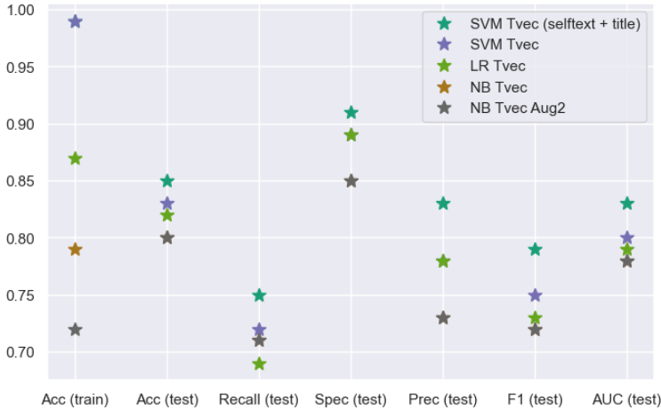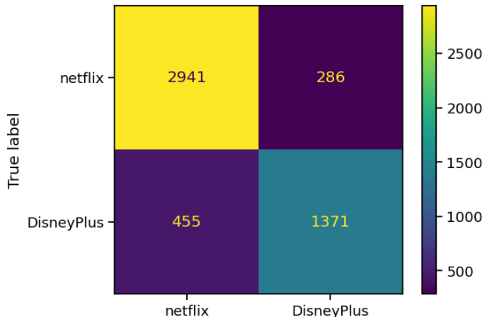
---

- Sentiment analysis insights

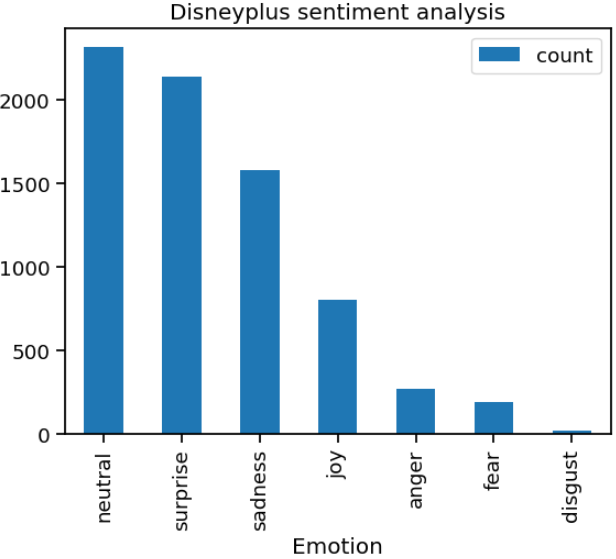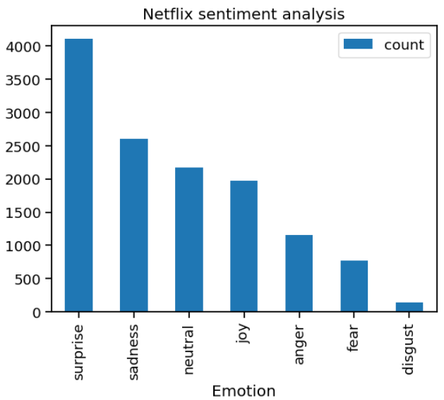

**Disney Plus**

Taking only extreme negative sentiments anger and disgust we can infer that users are annoyed with the streaming service or movies they were watching.

1) Surprised 😲
    - Topic adjectives: *having problem*
    - Topic subject: *star war, spider man, streaming service,marvel cartoon*
    
    
2) Sadness 😭

      - Topic subject: *credit card, movie series, star war, season available*

3) Joy 😀

    - Topic subject: *reddit comment, subreddit member, ask recommendation, thread reddit, discussion thread*

4) Fear 😨

    - Topic adjectives: *good horror, jump scare, like horror*

    - Topic subject: *american horror, horror story*

5) Disgust 🤢

Topic subject: *streaming service*

6) Anger 🤬

      - Topic adjectives: *really annoying*

      - Topic words: *episode episode, movie french, star war, streaming service, marvel star*

___

**Netflix**

Focusing on extreme negative sentiments anger and disgust, we can deduce that users are feeling annoyed at the streaming service or the casting choice of the show.

1) Surprised 😲
    - Topic subject: *width format, format auto ,xb preview*

1) Sadness 😭
    - Topic subject: *main character, stranger thing, breaking bad*

1) Joy 😀
    - Topic adjectives: *really enjoyed,really good*
    - Topic subject: *umbrella academy, streaming service, sci fi, sex education,stranger thing, breaking bad* 

1) Anger 🤬
    - Topic adjectives: *really annoying, super annoying*
    - Topic words: *streaming service, new episode*

1) Fear 😨
    - Topic adjectives: *good horror, jump scare, like horror*
    - Topic subject: *horror movie*

1) Disgust 🤢
    - Topic subject: *old girl, streaming service, young girl, sci fi*
