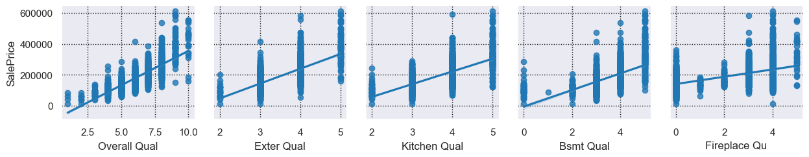
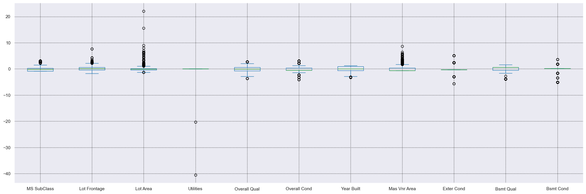

# Project 2: House Sale Price Predictor

## Problem Statement

The founder of a start-up company PropTechies highlighted that valuable time was lost between quotation queries and reply. The main reason was that the realtor have to be physically onsite for quotation. Therefore, to improve efficiency, we are task to provide a data driven solution by creating a Saleprice predictor. 

---
## Contents:
- [Background](#Background)
- [Data Import & Cleaning](#Data-import-&-cleaning)
- [Exploratory Data Analysis](#Exploratory-Data-Analysis)
- [Modeling Process](#Modeling-Process)
- [Data Visualization](#Data-Visualization)
- [SalePrice Predictor](#The-Predictor)
- [Kaggle Competition Submission](#Export-to-CSV-for-kaggle-submission)
- [Conclusions and Recommendations](#Conclusion-and-Recommendation)
---

## Background

There are many parameters and conditions when naming the price of the house. Some examples are condition, size, finishing, age, location and so on.
It will take a team of of realtor to physically be present to check, reserch, cross referencing and finally quoting the selling price. This might translate to loss in manpower, time and ultimately loss of revenue for the company. A solution to increase efficiency and also cut down required man power is greatly needed.

---
### DataSet used
* [`train.csv`](./datasets/train.csv): Kaggle dataset for training ([*source*](https://www.kaggle.com/competitions/dsi-us-11-project-2-regression-challenge/data))
* [`test.csv`](./datasets/test.csv): Kaggle dataset for scoring submissions ([*source*](https://www.kaggle.com/competitions/dsi-us-11-project-2-regression-challenge/data))

---
## Data import & cleaning

### Data cleaning

- *Step1- Loading dataset and checking dataframe structure*
- *Step2- Duplicated Rows*
- *Step3- Nan values*
    - Na for Nominal does not mean missing value. It represents absence of that particular feature.
    - fill Na with 0 which also represent absence of that particular numerical feature

---
## Exploratory Data Analysis

- *Step 1- Check correlation with y*
    - correlation score for SalePrice with all columns

    
- *Step 2- check liner relationship with sale price for filtered features based on correlation
- Quality vs Saleprice
    - there may have some linearity for quality features with saleprice

- Area vs Saleprice
    - there may have some linearity for Area features with saleprice

- Others vs Saleprice
    - there may have some linearity for the remaining features with saleprice

    
- *Step 3- check outliers*   
    
  
 

    
- Checking data shape after dropping rows for features with less than 10% outlier
    - Since after dropping rows with outliers resulted in more than 70% of the data.will be removing outliers from sale price
    - only removing outliers from saleprice (top 10 Max outliers)

---
## Feature engineering 
- check correlation between features
    - Features with high correrlation or VIF will be removed or feature engineered to reduce multicolinearity 

---
## Preprocessing for Modeling
- Declare X and y data
- Train/Test split
- Standard Scaling Xtrain and Xtest data

---
## Modeling Process & Evaluation
- LinerRegression
- Regularization techniques
    - Ridge
    - Lasso
- Linear SVR
- SGDRegressor
- KNNRegressor
- DecisionTreeRegressor
- AdaBoostRegressor + Ridge

Model evaluation will be using RMSE as main metric score and R2 as Sub metric scores
- RMSE scores will get us the lowest Error
- R2 scores will judge if model is overfitted.

### Baseline Reg Model 1 with Feature Engineered features
    Feature engineered columns 
    1) area_per_rooms_bath 
    2) renewed_years
    3) qual_avg
    
Metric Scoring:
- Test RMSE: 32419 
- Train R2: 0.79 
- Test R2: 0.82 
- Model not overfitted

    
### Reg Model 2 lr with nominal features
- Top 15 features from find best function

Metric Scoring:

- Test RMSE: 1869573890590931
- Train R2: 0.87
- Test R2: -615176890159517401088.00
- Model unable to predict

    
### Reg Model 3 (Regularization techniques)
- Top 15 features from find best function with regularizaion

Metric Scoring:
- Ridge
    - Test RMSE: 25699
    - Train R2: 0.87
    - Test R2: 0.88
    - Model not over fitted

Best params 
1) rd__alpha: 2.138775510204082

       
- Lasso
    - Test RMSE: 25715
    - Train R2: 0.87
    - Test R2: 0.88
    - Model not over fitted
    
Best params
1) las__alpha': 30.68163265306123,
2) las__selection': random

    

### Reg Model 4 LinearSVR

- Top 15 features from find best function

Metric Scoring:
- Test RMSE: 25748
- Train R2: 0.87
- Test R2: 0.88
- Model not over fitted

Best params
1) svm__C: 0.3755102040816327
2) svm__loss: 'squared_epsilon_insensitive'
 

    

### Reg Model 5 SGDRegressor

- Top 15 features from find best function

Metric Scoring:
- Test RMSE: 25964
- Train R2: 0.87
- Test R2: 0.88
- Model not over fitted

Best params
1) sgd__alpha: 0.1
1) sgd__early_stopping: True,
1) sgd__l1_ratio: 0.7612244897959184,
1) sgd__learning_rate: 'adaptive',
1) sgd__penalty: 'l1'
  

    
### Reg Model 6 KNeighborsRegressor

- Top 15 features from find best function

Metric Scoring:
- Test RMSE: 27974
- Train R2: 1.00
- Test R2: 0.86
- Model over fitted

Best params

1) knn__leaf_size: 10,
1) knn__n_neighbors: 8,
1) knn__p: 2,
1) knn__weights: 'distance'

    
### Reg Model 7 DecisionTreeRegressor

- Top 15 features from find best function

Metric Scoring:
- Test RMSE: 30849
- Train R2: 0.89
- Test R2: 0.83
- Model moderately over fitted

Best Params
1) tree__max_depth': None,
1) tree__max_features': 100,
1) tree__max_leaf_nodes': 100,
1) tree__min_samples_leaf': 10,
1) tree__min_samples_split': 10,
1) tree__splitter': 'best'
  

    

### Reg Model 8 AdaBoostRegressor + Ridge

- Top 15 features from find best function

Metric Scoring:
- Test RMSE: 25542
- Train R2: 0.87
- Test R2: 0.89
- Model not over fitted

Best Params
1) ada__learning_rate': 0.001
1) ada__loss': 'square'
1) ada__n_estimators': 50

    
---
## Data Visualization
### Best Model break down
- Best model: Reg Model 8 
- Features: 18 (3 numerical, 15 nominal)
- Test RMSE: 25542
- Train R2: 0.87
- Test R2: 0.89
- Top 5 features: qual_avg, ttl_area, Exterior2nd_VinylSd, rooms_bath, BsmtFin Type1_unf

    

- Residual distribution looks normally distributed

- Residual mean is around zero

---
## Conclusion and Recommendation

### Conclusion

Model 8 was chosen as the final model.
1) Data massaging for numerical, ordinal & categorical features
2) Most Outliers were kept in the fitting except a few abnormal high points.

### Recommendation
The prediction is able to predict within a certain error from actual SalePrice. Higher Saleprice may vary more.

---
It is recommended to focus on the following parameters as the model is based on these features
1) Average Quality of the house
1) Total Area of the living space
3) Number of rooms & toilet
1) Neighborhood
1) BsmtFin Type 1
1) Bsmt Exposure
1) Foundation
1) MS Zoning
1) Roof Style
1) Paved Drive
1) Garage Finish
1) BsmtFin Type 2
1) Exterior 2nd
1) Exterior 1st
1) Land Contour
1) Condition 1
1) Bldg Type
1) Sale Type
